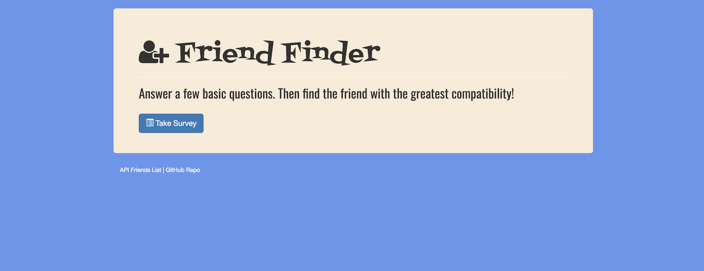

# FriendFinder




## What Is It?

This full-stack site will take in your results from a survey and then compare your answers with those from other users. The application will then display the name and picture of the user with the best overall match.

## How Do I Use It?

1. The application is hosted on Heroku, click on the link below to access it.
    * [FriendFinder on Heroku](https://murmuring-thicket-23252.herokuapp.com/)
   
2. If you prefer to run the application locally, clone this repository and then run:
    ```bash
    npm install
    ```
## Under the Hood

This application has been built using a HTML/CSS front end with a Node.js backend.  In addition, the following Node packages are used:

  * [express](https://www.npmjs.com/package/express)
  * [body-parser](https://www.npmjs.com/package/body-parser)
  * [path](https://nodejs.org/api/path.html)

## Error Handling

You will not be able to submit the survey page without providing a response to all of the questions.  You will be presented with an error dialog if you attempt to submit the survey without providing a response to all of the questions.
